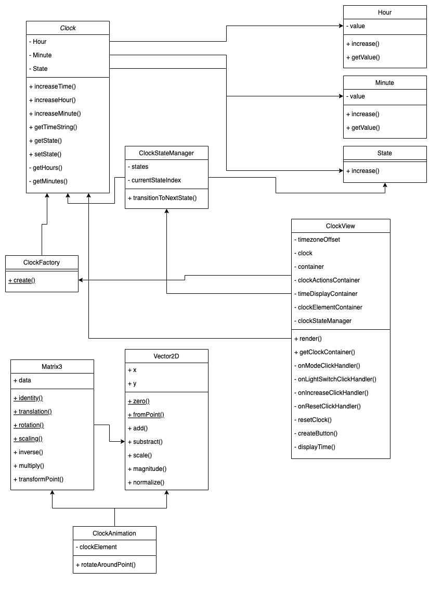

# template-ts
Template typescript project

```javascript
npm install
npm run build
npm run start
```

# UML Diagram

Below the UML class diagram as requested :



# Total time & Improvements

In total, I spent a bit more than 5 hours (splitted in two days) on this project. 

Yet, as an improvement I feel the Observer pattern could be suitable here, to handle the clock view and the animations updates for example. If you check the commits, you can see I tried an implementation but I wasn't satisfied so I deleted it.
